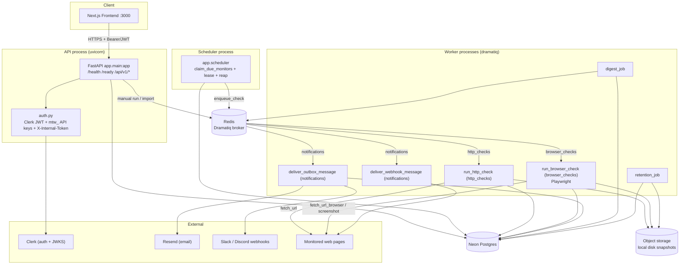
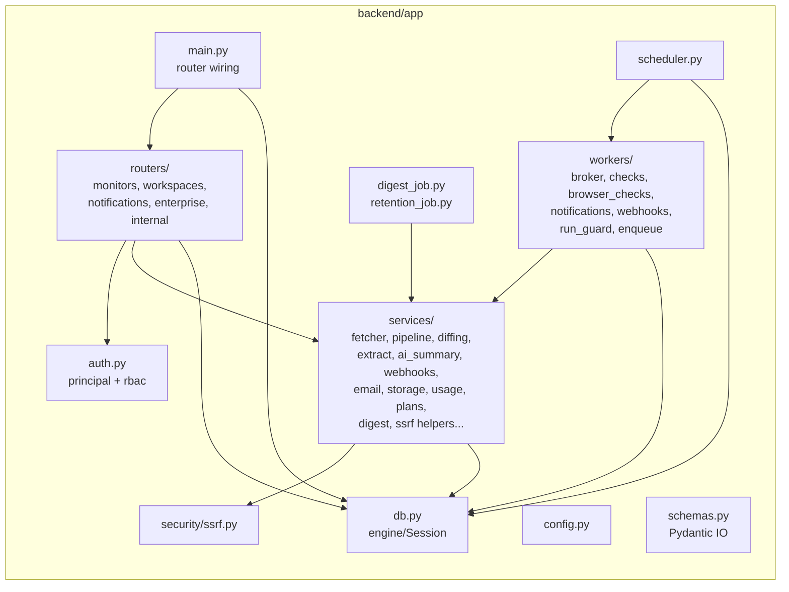
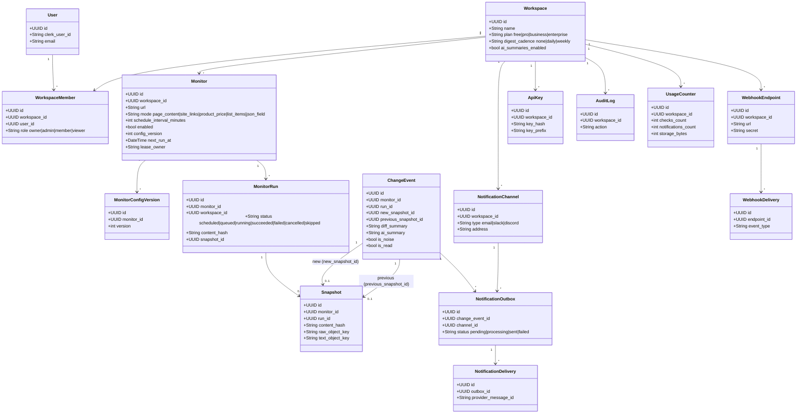
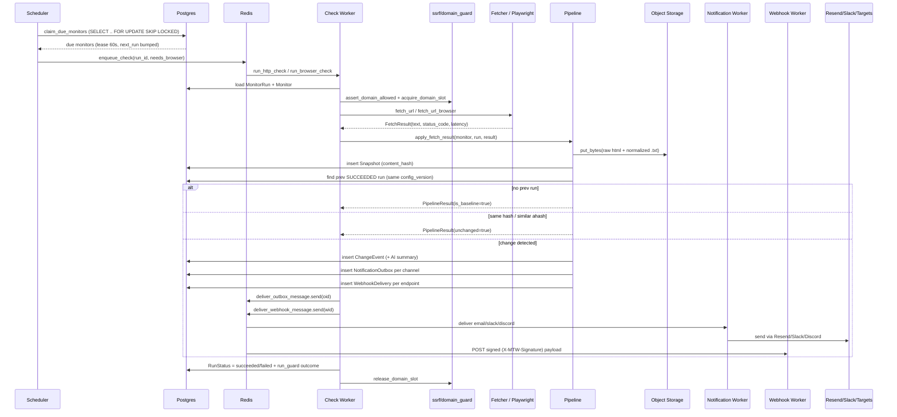
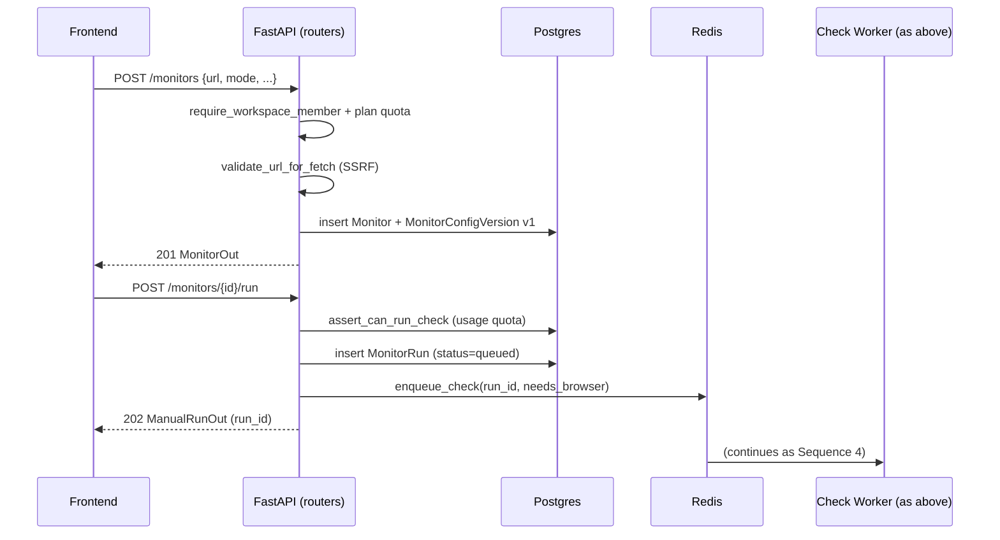
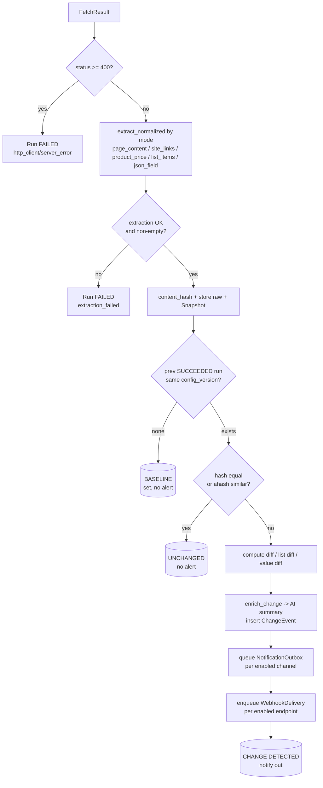
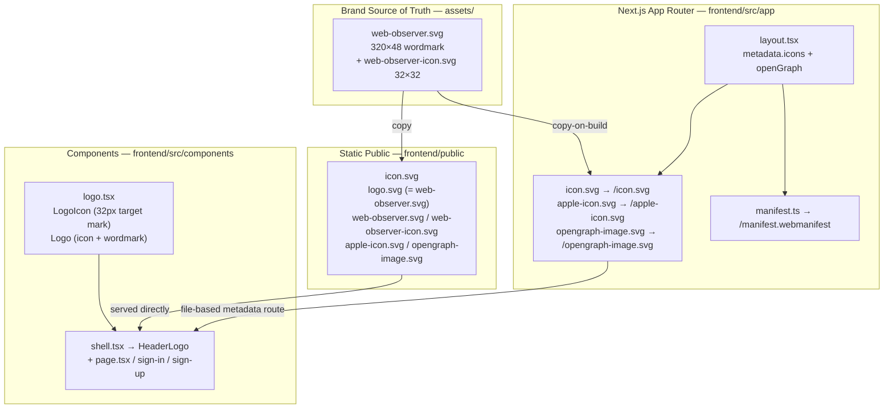

  

# Web Observer — Architecture as UML

Generated from a code review of the `backend/` and `frontend/` trees.
Stack: FastAPI + Dramatiq/Redis workers, Next.js, Neon Postgres, Clerk, Resend, local-disk object storage, optional Playwright.

## 1. Component / Deployment Diagram

## 2. Backend Module Structure (Package Diagram)

## 3. Data Model (Class Diagram / ERD)

## 4. Sequence Diagram — Scheduled Live Check

## 5. Sequence Diagram — Manual / API-Triggered Run

## 6. Pipeline Decision Flow (Activity Diagram)

## 7. Frontend Architecture & Brand System

**Brand spec — `assets/web-observer.svg:1` / `frontend/src/components/logo.tsx:15`**

* Mark: 32×32 (36×36 at 18px center) — `slate-900` rounded square `rx 9.5`, hairline track `r 9.5 @ 14% white`, scanning arc `sky-400 #38bdf8 1.55px` `M 16 6.5 A 9.5 9.5`, ping `r1.35 + r2.45@18%`, middle ring `r5.9 1.35px white 95%`, center dot `r2.35 white`. No literal eye / no zig-zag — reads at 16px favicon.
* Wordmark: `Inter 700 -0.03em` `Web #0f172a → #f8fafc (dark)` + `Observer 500 #64748b → #cbd5e1 (dark)`; SVG embeds `@media (prefers-color-scheme: dark)` so `assets/web-observer.svg` is theme-aware; React `Logo` uses `text-slate-900/dark:text-white` + `text-slate-500/dark:text-slate-300`.
* Assets: source in `assets/` (also `frontend/public/` for direct serving, `frontend/src/app/` for Next.js file-based metadata). `frontend/README.md:1` and root `README.md:2` header use `assets/web-observer.svg` (320w).

## Notes

* **Auth modes** (`auth.py`): Clerk JWT (`Authorization: Bearer`), workspace API keys (`mtw_...`), and internal token (`X-Internal-Token`) for dev/smoke tests. RBAC via `require_workspace_member` / `require_role(min_role)`.
* **Mode routing** (`workers/enqueue.py`): monitors with the `js_required` flag route to the `browser_checks` queue (Playwright); everything else goes to `http_checks`. (`site_links` rejects `js_required` at the schema layer since sitemaps are fetched over plain HTTP.)
* **Outbox pattern**: change detection writes `NotificationOutbox` + `WebhookDelivery` rows, then workers fan out. This decouples detection from delivery and gives at-least-once send with retry (`max_retries=5`).
* **SSRF guard** (`security/ssrf.py`): blocks private/loopback/link-local/metadata IPs and credentialed URLs before any fetch; redirects are re-validated in the fetcher.
* **Quotas/plans** (`services/usage.py`, `services/plans.py`): daily check/notification/storage counters per workspace, gated by plan.
* **Lease + reaper**: scheduler claims monitors with a 60s lease; `run_reaper` recovers stuck runs so HA scheduler/workers don't double-run.
* **Branding pipeline**: `assets/` is the source of truth; `frontend/public/` is the static fallback; `frontend/src/app/icon.svg` etc are Next.js metadata routes (generates `/icon.svg`, `/manifest.webmanifest`). `LogoIcon` is inline SVG (not ``) so it inherits Tailwind theming and scales via `size` prop (`shell.tsx:49` `iconSize={36}`). OG image `opengraph-image.svg` (1200×630) is served from both `src/app` and `public` and referenced in `layout.tsx:40`.
