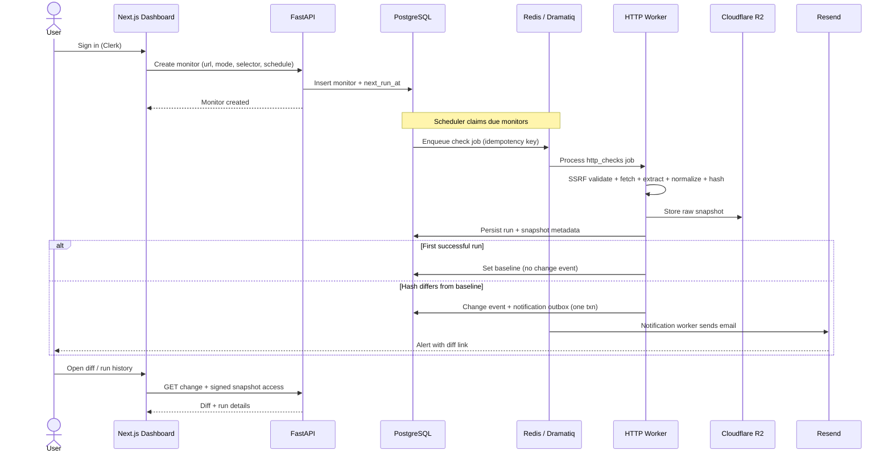

# MVP User Flow — End to End

Status: **Approved**  
Phase: 0

## Happy path

## Internal Phase 1 path (pre-dashboard)

Until Clerk + Next.js exist:

1. Operator creates workspace/user rows (seed or CLI).  
2. CLI or admin API creates monitors.  
3. Scheduler + workers run the same pipeline.  
4. Emails go to a configured test address.  
5. Diffs inspected via API or stored artifacts.

## States the user sees

| Concept | User-visible meaning |
|---------|----------------------|
| Baseline set | First success; monitoring active |
| Unchanged | Check succeeded; no alert |
| Changed | Alert sent; diff available |
| Failed | Error code + message; baseline unchanged |
| Paused | No new scheduled runs |

## Failure path (user-facing)

- Invalid URL / blocked target → create fails or run fails with clear code  
- Selector not found → `selector_not_found`; baseline not replaced  
- Site timeout / 5xx → retries; after consecutive failures, optional failure notification  
- Quota exceeded → create or schedule rejected with clear error  

## Config change rules

Changing URL, mode, or CSS selector:

1. Increments `config_version`  
2. Creates a new baseline on next success  
3. Does not alert on that first post-change success  
