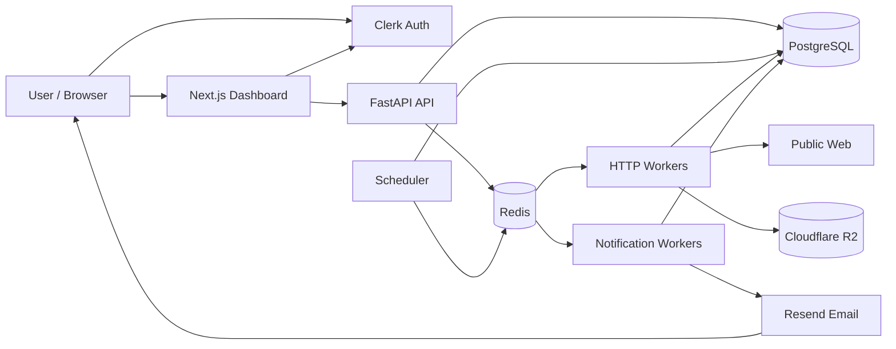
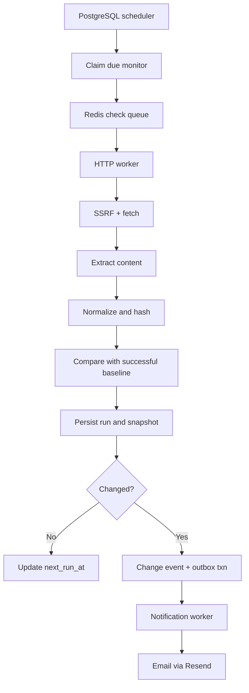

# Architecture — Phase 0

Status: **Approved**

## System context

## Check lifecycle

## Process topology

| Process | Responsibility |
|---------|----------------|
| `api` | REST API, authz, CRUD, manual trigger |
| `scheduler` | Poll due monitors, claim, enqueue |
| `worker-http` | Fetch, extract, hash, diff, outbox insert |
| `worker-notifications` | Deliver email (and later Slack/Discord) |
| `web` | Next.js dashboard (Phase 2+) |

Local: all via Docker Compose.  
Beta: separately deployable API, scheduler, workers; managed Postgres + Redis; R2 for blobs.

## Baseline and comparison rules

1. First successful run → baseline only; **no** change alert.  
2. Failed runs **never** replace last successful baseline.  
3. Compare only to last successful **compatible** snapshot (same config version semantics).  
4. Config version stored on every run.  
5. URL / selector / mode change → new baseline on next success.  
6. Empty extract is **not** automatically a valid change.  
7. Missing selector → extraction failure.  
8. Multiple selector matches → combine in document order (unless single-match rule).  
9. Returning to a previously seen value **is** a new change event.  
10. Optional confirmation check for high-signal monitors (later/config flag).

## Normalization (deterministic)

- Strip `script`, `style`, `noscript`, template content  
- Decode entities; normalize Unicode, whitespace, line endings  
- Preserve numbers, prices, dates, availability  
- Apply user ignore selectors/regex (when configured)  
- Store raw snapshot reference **and** normalized comparison text  

## Run states

`scheduled` → `queued` → `running` → `succeeded` | `failed` | `cancelled` | `skipped`

## Error codes (machine-readable)

`invalid_url`, `robots_disallowed`, `dns_error`, `blocked_address`, `connection_timeout`, `read_timeout`, `response_too_large`, `redirect_limit`, `unsupported_content_type`, `http_client_error`, `http_server_error`, `selector_not_found`, `extraction_failed`, `normalization_failed`, `storage_failed`, `internal_error`

## Retry policy

- Retry: transient network, DNS, timeout, `429`, selected `5xx`  
- Exponential backoff + jitter; honor `Retry-After` when reasonable  
- No endless retry for permanent validation/extraction errors  
- Cap attempts; terminal failed state visible in UI  
- User failure notification only after N consecutive failures (configurable)  

## Queue separation

| Queue | Work |
|-------|------|
| `http_checks` | Standard fetch checks |
| `notifications` | Outbox delivery |
| `browser_checks` | Shipped (Playwright JS-rendered checks; dedicated worker `--threads 1`) |

Separate concurrency, timeout, and retry per queue.

## Non-requirements (MVP infra)

- Kubernetes not required  
- Kafka not required  
- Browser workers not required until Phase 3  
