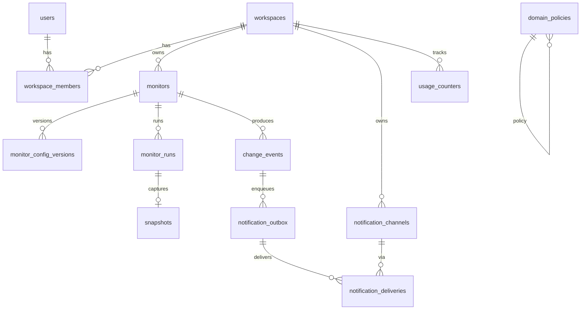

# Core ERD — Phase 0

Status: **Approved**  
ORM target: SQLAlchemy 2.x + Alembic

## Entity relationship overview

## Primary tables (MVP)

### `users`
| Column | Notes |
|--------|--------|
| id | UUID PK |
| clerk_user_id | unique, nullable in Phase 1 seed mode |
| email | unique |
| created_at, updated_at | timestamptz |

### `workspaces`
| Column | Notes |
|--------|--------|
| id | UUID PK |
| name | text |
| created_at, updated_at | |

### `workspace_members`
| Column | Notes |
|--------|--------|
| id | UUID PK |
| workspace_id | FK |
| user_id | FK |
| role | `owner` \| `member` (expand later) |
| unique | (workspace_id, user_id) |

### `monitors`
| Column | Notes |
|--------|--------|
| id | UUID PK |
| workspace_id | FK, indexed |
| name | text |
| url | text |
| mode | `whole_page` \| `css_selector` |
| css_selector | nullable |
| schedule_expression | e.g. interval or cron-like; MVP may use interval minutes |
| timezone | IANA tz |
| next_run_at | timestamptz, indexed for scheduler |
| enabled | bool |
| config_version | int |
| timeout_seconds | int |
| max_response_bytes | int |
| confirmation_required | bool default false |
| lease_owner | nullable (scheduler claim) |
| lease_expires_at | nullable |
| created_at, updated_at | |

### `monitor_config_versions`
| Column | Notes |
|--------|--------|
| id | UUID PK |
| monitor_id | FK |
| version | int |
| url, mode, css_selector | snapshot of config |
| created_at | |

### `monitor_runs`
| Column | Notes |
|--------|--------|
| id | UUID PK |
| monitor_id, workspace_id | FKs |
| config_version | int |
| idempotency_key | unique |
| scheduled_at, queued_at, started_at, finished_at | |
| status | enum-like text |
| attempt | int |
| http_status | nullable |
| latency_ms | nullable |
| content_hash | nullable |
| snapshot_id | nullable FK |
| error_code, error_message | nullable |
| created_at | |

### `snapshots`
| Column | Notes |
|--------|--------|
| id | UUID PK |
| workspace_id, monitor_id | FKs |
| run_id | FK |
| content_hash | text |
| normalized_text | text or compressed (size policy) |
| raw_object_key | R2 key |
| content_type | text |
| byte_size | int |
| created_at | |

### `change_events`
| Column | Notes |
|--------|--------|
| id | UUID PK |
| workspace_id, monitor_id | FKs |
| run_id | FK |
| previous_snapshot_id | FK |
| new_snapshot_id | FK |
| previous_hash, new_hash | text |
| diff_summary | text (short) |
| created_at | |
| unique protection | e.g. unique(run_id) for change |

### `notification_channels`
| Column | Notes |
|--------|--------|
| id | UUID PK |
| workspace_id | FK |
| type | `email` |
| address | email |
| enabled | bool |
| created_at | |

### `notification_outbox`
| Column | Notes |
|--------|--------|
| id | UUID PK |
| workspace_id | FK |
| change_event_id | FK nullable (or failure notice type) |
| channel_id | FK |
| payload | jsonb |
| status | `pending` \| `processing` \| `sent` \| `failed` |
| idempotency_key | unique |
| available_at | timestamptz |
| attempts | int |
| last_error | nullable |
| created_at, updated_at | |

### `notification_deliveries`
| Column | Notes |
|--------|--------|
| id | UUID PK |
| outbox_id | FK |
| channel_id | FK |
| provider_message_id | nullable |
| status | text |
| created_at | |

### `domain_policies`
| Column | Notes |
|--------|--------|
| domain | text PK or unique |
| robots_mode | policy flags |
| blocked | bool |
| notes | text |
| updated_at | |

### `usage_counters`
| Column | Notes |
|--------|--------|
| workspace_id | FK |
| period_start | date or timestamptz |
| checks_count | int |
| notifications_count | int |
| storage_bytes | bigint |
| unique | (workspace_id, period_start) |

## Later tables (not MVP schema blockers)

`api_keys`, `audit_logs`, `subscriptions`, `invoices`, `monitor_ignore_rules`

## Indexing priorities

- `monitors (enabled, next_run_at)` for scheduler  
- `monitor_runs (monitor_id, created_at desc)`  
- `change_events (monitor_id, created_at desc)`  
- `notification_outbox (status, available_at)`  
- All tenant tables: `workspace_id`

## Idempotency rules

1. Every scheduled execution has a unique `idempotency_key`.  
2. Only one active run per monitor at a time.  
3. Change events protected against duplicates (e.g. unique on `run_id`).  
4. Notification deliveries use idempotency keys.  
5. Retries must not duplicate change events or alerts.  
6. Change-event creation + outbox insert = **one database transaction**.
