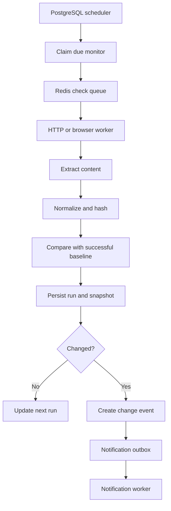

# Web Observer Platform — Final Roadmap

## 1. Product Vision

Web Observer is a web change-detection and alerting platform. It lets users monitor public web pages or selected page sections and receive high-signal alerts with clear before-and-after diffs.

Key promise:

> Tell me when the web pages I care about change and clearly explain what changed.

### 1.1 Initial Target Users

The first release targets developers, product teams, founders, and researchers monitoring:

- Documentation, changelogs, and release notes
- Product pricing and availability
- Competitor landing pages and feature lists
- Public job boards
- Public government notices and tenders

### 1.2 MVP Scope

The MVP includes:

- Public HTTP/HTTPS pages
- Whole-page text monitoring
- CSS-selector monitoring
- Configurable schedules
- Text extraction and deterministic normalization
- Hash-based change detection
- Before-and-after text diffs
- Email alerts
- Monitor run history
- Workspace-scoped web dashboard
- Manual and scheduled checks

### 1.3 MVP Non-Goals

The following are intentionally deferred:

- XPath selectors
- Authenticated or private pages
- CAPTCHA, paywall, login, or bot-defense bypassing
- JSON/API field monitoring
- List or collection monitoring
- Visual comparison
- AI summaries
- Slack, Discord, and SMS alerts
- Bulk imports
- Deep crawling
- Enterprise features

These capabilities remain part of the long-term roadmap but must not delay validation of the core product.

---

## 2. Product Behavior

### 2.1 Monitoring Modes

#### MVP

- Whole-page normalized text monitoring
- Partial-page monitoring through a CSS selector

#### Later Releases

- JSON/API field monitoring
- List monitoring with added, removed, and modified items
- Visual monitoring with screenshots and image comparison
- JavaScript-rendered page monitoring with Playwright
- Multi-page and deep-site crawling

### 2.2 Check Lifecycle

Each scheduled check follows this lifecycle:

1. The scheduler identifies a due monitor.
2. The monitor is claimed using a database lease.
3. An idempotent check job is added to the queue.
4. The worker validates and fetches the URL.
5. The configured content is extracted and normalized.
6. A deterministic content hash is calculated.
7. The hash is compared with the last successful baseline.
8. A snapshot and monitor run are persisted.
9. If content changed, a diff and change event are created.
10. A notification is added to the transactional outbox.
11. A notification worker delivers the alert.

### 2.3 Baseline and Comparison Rules

- The first successful run creates a baseline and does not send a change alert.
- Failed runs never replace the last successful baseline.
- Comparisons always use the last successful compatible snapshot.
- A monitor configuration version is stored with every run.
- Changing the URL, selector, or extraction mode creates a new baseline.
- Empty extracted content is not automatically considered a valid change.
- A missing selector is reported as an extraction failure.
- Multiple selector matches are combined in stable document order unless the user selects a single-match rule.
- Returning to a previously seen value creates a new change event.
- High-signal monitors may optionally require a confirmation check before an alert is sent.

### 2.4 Extraction and Normalization

Normalization must be deterministic and conservative.

Default normalization includes:

- Remove `script`, `style`, `noscript`, and template content.
- Decode HTML entities.
- Normalize Unicode, whitespace, and line endings.
- Preserve meaningful numbers, prices, dates, and availability values.
- Apply user-configured ignore selectors and regular expressions.
- Produce a stable text representation.

The system must not automatically remove every timestamp, number, navigation element, or banner because doing so could hide legitimate changes.

Store both:

- A reference to the raw fetched snapshot
- The normalized content used for comparison

### 2.5 Monitor Run States

Monitor runs use explicit states:

- `scheduled`
- `queued`
- `running`
- `succeeded`
- `failed`
- `cancelled`
- `skipped`

Failures use machine-readable error codes, including:

- `invalid_url`
- `robots_disallowed`
- `dns_error`
- `blocked_address`
- `connection_timeout`
- `read_timeout`
- `response_too_large`
- `redirect_limit`
- `unsupported_content_type`
- `http_client_error`
- `http_server_error`
- `selector_not_found`
- `extraction_failed`
- `normalization_failed`
- `storage_failed`
- `internal_error`

---

## 3. Final Technology Stack

The initial stack choices are fixed to avoid implementation delays.

### 3.1 Backend

- Language: Python
- API framework: FastAPI
- API style: REST
- API schema: OpenAPI
- ORM: SQLAlchemy
- Database migrations: Alembic
- Validation: Pydantic
- Database: PostgreSQL
- Queue and rate-limit storage: Redis
- Worker framework: Dramatiq
- HTTP client: `httpx`
- HTML parsing and CSS selection: `selectolax`
- JavaScript rendering: Playwright in a later phase
- Error monitoring: Sentry
- Structured logging: JSON logs
- Testing: pytest

A PostgreSQL-driven scheduler will manage `next_run_at` values. Monitor schedules will not be represented as individual operating-system cron jobs or worker scheduler entries.

### 3.2 Frontend

- Framework: Next.js
- Language: TypeScript
- Styling: Tailwind CSS
- Components: shadcn/ui
- API integration: typed REST client generated from OpenAPI
- Testing: Vitest and Playwright

### 3.3 Authentication

- Authentication provider: Clerk
- Clerk-issued tokens are verified by FastAPI.
- Authorization is enforced by workspace membership.
- All workspace-owned queries must be scoped by `workspace_id`.
- Custom JWT authentication will not be built for the MVP.

The authentication provider can be reconsidered through an architecture decision record if pricing, compliance, or regional availability requires it.

### 3.4 Storage

- PostgreSQL stores application metadata, hashes, run state, and normalized content where appropriate.
- Cloudflare R2 stores larger raw HTML snapshots and later screenshots.
- Stored objects use workspace-scoped paths and non-guessable identifiers.
- Signed URLs provide controlled object access.
- Object lifecycle policies enforce retention limits.

### 3.5 Notifications

MVP:

- Email through Resend
- Transactional notification outbox
- Delivery status and retry tracking

Later:

- Discord
- Slack
- Generic outbound webhooks
- Daily and weekly digests
- SMS only if customer demand justifies it

### 3.6 AI

AI is not part of core change detection.

A later release may use an API-accessible language model to:

- Summarize deterministic diffs
- Classify change types
- Help users generate ignore rules

The provider will be selected before the AI phase using an architecture decision record covering cost, privacy, retention, regional availability, and model quality.

### 3.7 Infrastructure

#### Local Development

Docker Compose runs:

- PostgreSQL
- Redis
- FastAPI
- Scheduler
- Dramatiq workers
- Next.js

#### Internal Prototype

- A VM with at least 2–4 GB of memory
- Managed PostgreSQL when affordable
- Redis with appropriate persistence
- Separate HTTP worker process
- Cloudflare R2 for snapshots

A GCP `e2-micro` instance is not considered sufficient for the full public system, especially after Playwright is introduced.

#### Public Beta

- Managed PostgreSQL
- Managed Redis or a properly maintained Redis deployment
- Separately deployable API, scheduler, HTTP workers, and browser workers
- Automated backups
- Staging and production environments
- Resource and concurrency limits

Kubernetes is not required for the MVP and will only be introduced when operational scale justifies it.

---

## 4. Core Data Model

### 4.1 Primary Tables

- `users`
- `workspaces`
- `workspace_members`
- `monitors`
- `monitor_config_versions`
- `monitor_runs`
- `snapshots`
- `change_events`
- `notification_channels`
- `notification_outbox`
- `notification_deliveries`
- `domain_policies`
- `usage_counters`

Later:

- `api_keys`
- `audit_logs`
- `subscriptions`
- `invoices`
- `monitor_ignore_rules`

### 4.2 Monitor Fields

A monitor should include:

- `id`
- `workspace_id`
- `name`
- `url`
- `mode`
- `css_selector`
- `schedule_expression`
- `timezone`
- `next_run_at`
- `enabled`
- `config_version`
- `timeout_seconds`
- `max_response_bytes`
- `confirmation_required`
- `created_at`
- `updated_at`

### 4.3 Monitor Run Fields

A monitor run should include:

- `id`
- `monitor_id`
- `workspace_id`
- `config_version`
- `idempotency_key`
- `scheduled_at`
- `queued_at`
- `started_at`
- `finished_at`
- `status`
- `attempt`
- `http_status`
- `latency_ms`
- `content_hash`
- `snapshot_id`
- `error_code`
- `error_message`
- `created_at`

### 4.4 Idempotency Rules

- Every scheduled execution receives a unique idempotency key.
- Only one active run is permitted for a monitor at a time.
- Change events must be protected against duplicate creation.
- Notification deliveries use idempotency keys.
- A retry must not create duplicate change events or send duplicate alerts.
- Change-event creation and notification-outbox creation occur in one database transaction.

---

## 5. Scheduler, Queue, and Retry Design

### 5.1 Scheduler

The scheduler:

- Polls PostgreSQL for monitors where `next_run_at <= now()`.
- Claims monitors with `FOR UPDATE SKIP LOCKED` or a timed lease.
- Calculates and stores the next run time.
- Adds randomized jitter to avoid traffic spikes.
- Enqueues idempotent jobs in Redis.
- Recovers expired leases.
- Prevents overlapping executions for the same monitor.

### 5.2 Queue Separation

Initial queues:

- `http_checks`
- `notifications`

Later queues:

- `browser_checks`
- `ai_summaries`
- `webhook_deliveries`

Each queue has separate concurrency, timeout, and retry policies.

### 5.3 Retry Policy

- Retry temporary network, DNS, timeout, `429`, and selected `5xx` failures.
- Use exponential backoff with jitter.
- Respect `Retry-After` where reasonable.
- Do not repeatedly retry permanent validation or extraction errors.
- Cap retry attempts.
- Move permanently failed jobs into a visible failed state.
- Notify users only after a configured number of consecutive monitor failures.

---

## 6. Security, Compliance, and Safety

### 6.1 SSRF Protection

Because users can submit arbitrary URLs, SSRF protection is a Phase 1 requirement.

The fetcher must:

- Allow only `http` and `https`.
- Reject URLs containing embedded credentials.
- Reject malformed or ambiguous URLs.
- Normalize internationalized domain names safely.
- Block loopback, private, link-local, multicast, and reserved addresses.
- Block cloud metadata endpoints.
- Validate all DNS results.
- Validate the destination again after every redirect.
- Enforce a redirect limit.
- Defend against DNS rebinding.
- Restrict egress network access where possible.
- Apply the same controls to user-configured webhook destinations.

### 6.2 Fetch Limits

Every request must enforce:

- Connection timeout
- Read timeout
- Total execution timeout
- Maximum redirect count
- Maximum response size
- Maximum decompressed response size
- Allowed content types
- Per-domain concurrency
- Per-domain request rate
- Global worker concurrency

### 6.3 Application Security

- Sanitize all diff output before rendering.
- Never directly render downloaded HTML in the application.
- Any future HTML preview must use a sandboxed iframe with scripts disabled.
- Enforce workspace authorization on every resource.
- Encrypt application secrets.
- Never include credentials or sensitive headers in logs.
- Use signed object-storage URLs.
- Maintain dependency and container vulnerability scanning.
- Apply secure HTTP headers and CSRF protection where applicable.

### 6.4 Access and Crawling Policy

- Monitor public pages only during the MVP.
- Respect applicable `robots.txt` directives under RFC 9309.
- Respect site terms and applicable laws.
- Use an honest User-Agent with a contact URL or email.
- Do not bypass CAPTCHA, authentication, paywalls, or bot defenses.
- Back off on `429`, repeated `403`, and server failures.
- Provide domain owners with a way to contact or block the service.

`robots.txt` compliance does not by itself grant legal permission, and it is not the only compliance requirement.

### 6.5 Privacy and Retention

- Publish a clear privacy policy.
- Define retention periods for raw snapshots, normalized content, runs, and alerts.
- Allow users to delete monitors and associated history.
- Apply lifecycle deletion policies to object storage.
- Document how deleted data is handled in backups.
- Encrypt data in transit and at rest.
- Do not send raw private content or credentials to an LLM.
- Document external subprocessors.
- Provide notification preferences and unsubscribe controls for non-essential email.

Authenticated page monitoring is deferred until credential encryption, access auditing, and stricter worker isolation are designed.

---

## 7. Resource Limits

Limits must exist before public access, even if billing is introduced later.

Initial configurable limits:

- Minimum check interval
- Maximum monitors per workspace
- Maximum checks per day
- Maximum browser checks per day
- Maximum response size
- Maximum snapshot storage
- Maximum notification deliveries
- Per-domain request rate
- Per-domain concurrency
- Global queue concurrency
- API request rate
- Snapshot retention period

Internal administrators may grant higher limits to selected beta workspaces.

---

## 8. Implementation Roadmap

The estimates below assume two experienced developers. A solo implementation may require five to eight months for a dependable paid beta.

### Phase 0 — Validation and Architecture

**Weeks 1–2**

Goals:

- Interview potential users.
- Confirm the initial persona and highest-value use case.
- Validate willingness to use or pay for the product.
- Finalize the MVP scope and non-goals.
- Create architecture decision records.
- Create the core ERD.
- Define run states and failure codes.
- Design scheduler and worker behavior.
- Complete an SSRF and tenant-isolation threat model.
- Define retention and quota policies.
- Define measurable beta success targets.

Deliverables:

- Approved product scope
- Architecture diagram
- Core ERD
- Threat model
- API outline
- Initial backlog
- Deployment plan
- Architecture decision records

Exit criteria:

- No unresolved MVP technology choices
- Scheduler and retry behavior documented
- Security requirements approved
- MVP user flow documented end to end

### Phase 1 — Internal Vertical Slice

**Weeks 3–5**

Goals:

- Create the FastAPI application.
- Configure SQLAlchemy and Alembic.
- Implement monitor CRUD.
- Implement PostgreSQL scheduling with `next_run_at`.
- Implement Dramatiq HTTP workers.
- Implement the secure `httpx` fetcher.
- Implement SSRF protections and response limits.
- Implement whole-page and CSS-selector extraction.
- Implement deterministic normalization and content hashing.
- Implement first-run baseline behavior.
- Generate text diffs.
- Store snapshots in Cloudflare R2.
- Store monitor runs and structured failures.
- Implement the notification outbox.
- Send email notifications through Resend.
- Provide a CLI or internal admin interface.
- Add idempotency and retry handling.

Deliverables:

- Internal end-to-end monitoring flow
- Reliable monitoring of 10–20 controlled public URLs
- Run history and diagnostics
- Email alerts with diff links
- Automated backend tests

Exit criteria:

- No duplicate alerts during retry tests
- Failed runs do not replace successful baselines
- SSRF test suite passes
- Checks recover from worker restarts
- Snapshot retention and deletion work correctly

### Phase 2 — Private Beta Dashboard

**Weeks 6–9**

Goals:

- Integrate Clerk authentication.
- Implement workspace membership and authorization.
- Build the Next.js dashboard.
- Add monitor list and detail pages.
- Add the monitor creation wizard.
- Add history and diff views.
- Add pause, resume, delete, and manual-run actions.
- Add schedule and timezone configuration.
- Add alert preferences.
- Add quotas and minimum check intervals.
- Add onboarding and basic product analytics.
- Add secure snapshot access.

Deliverables:

- Complete private-beta user flow
- Workspace-isolated dashboard
- Users can create a monitor and receive a change alert
- Users can inspect runs, failures, and diffs

Exit criteria:

- Tenant-isolation tests pass
- A user cannot access another workspace's resources
- Quotas are enforced
- Core workflow succeeds without administrative intervention

### Phase 3 — Reliability and JavaScript Rendering

**Weeks 10–13**

Goals:

- Introduce a separate `browser_checks` queue.
- Run Playwright workers separately from HTTP workers.
- Support monitors explicitly marked `js_required`.
- Use explicit selectors and browser lifecycle events instead of arbitrary sleeps.
- Apply browser CPU, memory, and execution limits.
- Recycle browser processes safely.
- Block unnecessary media and third-party requests where appropriate.
- Add per-domain rate limits and concurrency controls.
- Add circuit breakers for repeatedly failing domains.
- Add monitor failure notifications.
- Add user-configured ignore selectors and regex rules.
- Improve extraction diagnostics.
- Add operational dashboards and queue monitoring.
- Test database backups and restoration.

Deliverables:

- Reliable monitoring for selected JavaScript-heavy pages
- Separate HTTP and browser capacity controls
- Reduced false positives
- Better failure explanations

Exit criteria:

- Browser failures cannot exhaust API resources
- Browser checks respect the same SSRF rules as HTTP checks
- Backup restoration is verified
- Domain-level throttling works under load

### Phase 4 — Structured and Visual Monitoring

**Weeks 14–17**

Goals:

- Add JSON endpoint monitoring.
- Add JSONPath-style field selection.
- Add list monitoring.
- Detect added, removed, and modified list items.
- Add screenshot capture.
- Add perceptual image hashes.
- Add visual region selection.
- Add visual before-and-after comparison.
- Add storage and retention limits for screenshots.

Deliverables:

- Structured API change detection
- Collection change events
- Basic visual monitoring
- Mode-specific diff views

Exit criteria:

- Each monitoring mode has deterministic fixtures and tests
- Visual and structured checks have separate usage limits
- Large screenshots and payloads cannot exhaust storage

### Phase 5 — AI and Alert Expansion

**Weeks 18–21**

Goals:

- Select an LLM provider through an architecture decision record.
- Generate summaries from size-limited deterministic diffs.
- Classify changes such as pricing, legal, content, design, or availability.
- Add daily and weekly digest emails.
- Add Slack and Discord channels.
- Add noise feedback.
- Add AI usage and cost tracking.
- Add privacy controls for AI processing.

AI safety requirements:

- Treat webpage content as untrusted input.
- Keep system instructions separate from page content.
- Limit input and output tokens.
- Redact sensitive data where practical.
- Store model and prompt versions.
- Use deterministic alerts if AI is unavailable.
- Never use AI as the only mechanism for detecting changes.
- Never silently suppress critical changes based only on AI output.

Deliverables:

- Optional human-readable change summaries
- Change categories
- Digests and expanded alert channels
- Per-workspace AI usage reporting

### Phase 6 — Bulk Workflows and Monetization

**Weeks 22–25**

Goals:

- Add CSV and JSON imports.
- Validate and deduplicate imported monitors.
- Add generic outbound webhooks.
- Sign webhook payloads.
- Add webhook delivery logs and retries.
- Publish Zapier and n8n examples.
- Add API keys.
- Add usage metering.
- Add subscription and billing integration.
- Add workspace plans and enforce plan limits.

Deliverables:

- Bulk monitor creation
- Downstream automation workflows
- Metered plans
- Paid beta readiness

### Phase 7 — Scaling and Enterprise

**Ongoing and demand-driven**

Goals:

- Partition queues by workload or region.
- Improve distributed scheduler capacity.
- Add adaptive scheduling and auto-throttling.
- Cache shared public fetches where legally and technically appropriate.
- Add role-based access control.
- Add audit logs.
- Add exports and advanced reporting.
- Add SSO/SAML where customer demand exists.
- Evaluate Scrapy for deep crawling.
- Evaluate Kafka only if Redis-based queues no longer meet measured requirements.
- Evaluate regional execution and data residency.
- Consider Kubernetes only when operational requirements justify it.

Deliverables:

- Higher-volume customer support
- Enterprise controls
- A scaling path based on measured bottlenecks

---

## 9. Testing and Delivery Strategy

### 9.1 Automated Tests

Add:

- Unit tests for URL validation.
- SSRF tests for IPv4, IPv6, redirects, metadata endpoints, and DNS behavior.
- Unit tests for extraction and normalization.
- Golden-file tests for text diffs.
- Scheduler and lease tests.
- Retry and idempotency tests.
- Notification outbox tests.
- Workspace-isolation tests.
- API integration tests.
- R2 storage integration tests.
- Playwright worker smoke tests.
- Frontend component tests.
- End-to-end tests for the core user flow.

Use saved HTML and controlled test servers. Do not depend on live third-party websites in the automated test suite.

### 9.2 Continuous Integration

CI must run:

- Python formatting and linting
- Python type checks
- Backend tests
- TypeScript linting and type checks
- Frontend tests
- Migration validation
- Dependency vulnerability checks
- Container image checks

### 9.3 Environments and Releases

Maintain:

- Local environment
- Automated test environment
- Staging environment
- Production environment

Production requirements:

- Automated database backups
- Periodic restore tests
- Database migration procedure
- Rollback procedure
- Structured logs
- Error monitoring
- Queue depth monitoring
- Worker health monitoring
- Storage usage monitoring
- Deployment health checks

---

## 10. Observability

Track:

- Scheduled checks and queue delay
- Check duration and fetch latency
- Extraction failures
- HTTP status distribution
- Change-event count
- Notification delivery latency and failures
- Retry counts and queue depth
- Active worker count
- Snapshot storage usage
- Per-domain error rates
- Browser memory and execution time
- AI token usage and cost

Logs must include correlation identifiers for:

- Workspace
- Monitor
- Monitor run
- Change event
- Notification delivery

Sensitive page content, authorization headers, cookies, and credentials must not be included in logs.

---

## 11. KPIs and Success Metrics

### 11.1 Private-Beta Targets

Initial targets:

- At least 99% successful eligible checks, excluding invalid or externally blocked targets.
- At least 95% of lightweight checks complete within 15 seconds.
- At least 99% of checks start within five minutes of their scheduled time.
- Fewer than one duplicate notification per 10,000 deliveries.
- At least 90% of rated alerts are considered useful.
- Zero cross-workspace data-access incidents.
- Zero successful requests to blocked internal network destinations.
- At least 30% four-week workspace retention during beta.

### 11.2 Product Metrics

Track:

- Active monitors and workspaces
- Monitored domains
- Checks per day
- Changes detected
- Alert click-through rate
- Diff views
- Time from scheduled check to notification
- Monitors paused or deleted after noisy alerts
- Percentage of events marked as noise
- Weekly and monthly workspace retention
- Trial-to-paid conversion

### 11.3 Cost Metrics

Track:

- Cost per 1,000 HTTP checks
- Cost per 1,000 browser checks
- Storage cost per workspace
- Notification cost per workspace
- AI cost per summarized event
- Infrastructure cost per active monitor

---

## 12. Final Stack Summary

- Backend: Python, FastAPI, SQLAlchemy, Alembic, Pydantic
- API: REST with OpenAPI
- Database: PostgreSQL
- Queue and rate limits: Redis
- Workers: Dramatiq
- Scheduler: PostgreSQL-driven scheduler using `next_run_at`
- HTTP fetching: `httpx`
- HTML extraction: `selectolax`
- JavaScript rendering: Playwright in a dedicated worker tier
- Frontend: Next.js, TypeScript, Tailwind CSS, shadcn/ui
- Authentication: Clerk with FastAPI token verification
- Snapshot storage: Cloudflare R2
- Email: Resend
- Observability: Sentry, structured logs, operational metrics
- Testing: pytest, Vitest, Playwright
- Local infrastructure: Docker Compose
- Production infrastructure: managed PostgreSQL, managed Redis, separate API and worker services
- AI: deferred until deterministic monitoring is reliable
- Kubernetes: deferred until justified by measured scale

---

## 13. Definition of MVP Completion

The MVP is complete when a private-beta user can:

1. Sign in.
2. Create or join a workspace.
3. Create a whole-page or CSS-selector monitor.
4. Choose an allowed schedule.
5. See the first successful baseline.
6. Receive an email when content changes.
7. Open a secure before-and-after diff.
8. Inspect successful and failed runs.
9. Pause, resume, update, or delete the monitor.
10. Delete associated snapshots and history.

The MVP must also demonstrate:

- Workspace isolation
- SSRF protection
- Idempotent retries
- No duplicate alerts during normal retry scenarios
- Quota enforcement
- Secure snapshot access
- Database backup and restoration
- Operational visibility into failed and delayed checks

Development should proceed to later monitoring modes only after these requirements are met.
